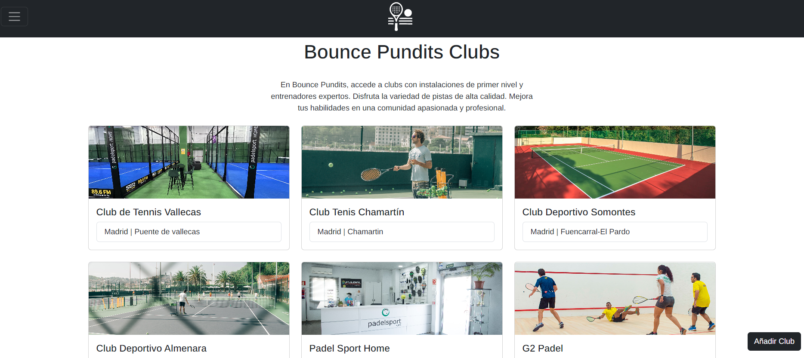
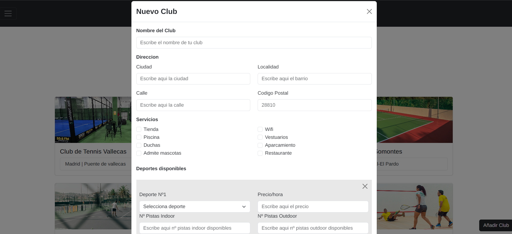

# Bounce Pundits

## Description

Bounce Pundits es una plataforma donde puedes encontrar clubes de deportes de raqueta, agregar comentarios y evaluar cada uno de ellos.

## How it works

Diseñamos una plataforma intuitiva destinada a proporcionar a los usuarios una forma sencilla de encontrar y evaluar clubes de deportes de raqueta.

Además, desarrollamos un servidor utilizando JSON para gestionar los datos de manera eficiente y proporcionar una experiencia de usuario fluida.

Puedes encontrar el código del backend [aquí](https://github.com/martamerchan16/json-server-backend).

### Funcionalidades Principales:

1. **Descubrimiento de Clubs:** 
   - Accede a información detallada sobre los clubs, incluyendo su localización a través de Google Maps, servicios ofrecidos y deportes disponibles.

2. **Reseñas de Usuarios:** 
   - Consulta reseñas de otros usuarios para evaluar la calidad de los clubs.

3. **Búsqueda en Tiempo Real:** 
   - Filtra clubes por nombre y ubicación al instante.

4. **Interacción del Usuario:**
   - **Gestión de Contenidos:** Los usuarios pueden añadir, editar y eliminar clubs y reseñas mediante formularios intuitivos.
   - **Puntuación de Clubs:** Los usuarios pueden calificar los clubs, puntuándolos según su experiencia.
   
Bounce Pundits combina la pasión por el deporte con una experiencia de usuario fluida y funcional, permitiendo a los amantes de la raqueta descubrir, compartir y disfrutar de nuevos clubs de manera interactiva.

## Demo

Try [Bounce Pundits](https://bounce-pundits.netlify.app/) yourself!
